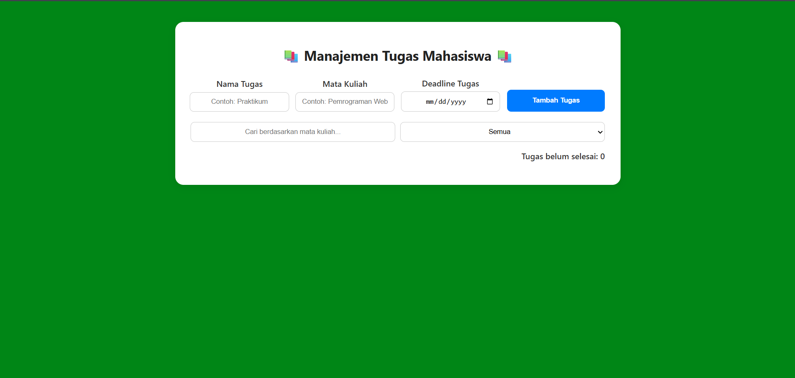
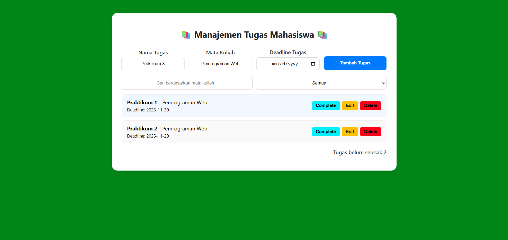
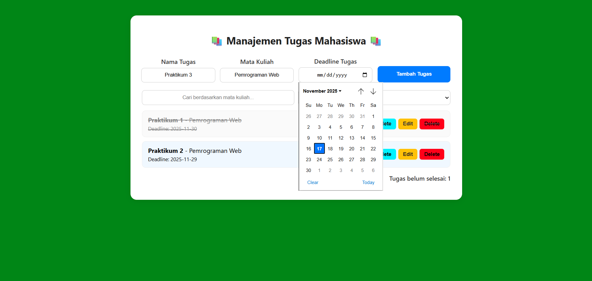
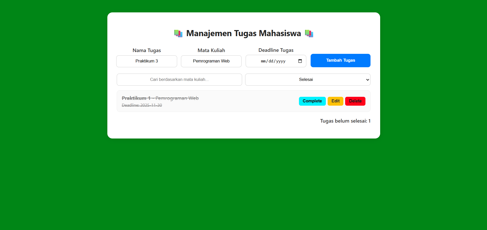
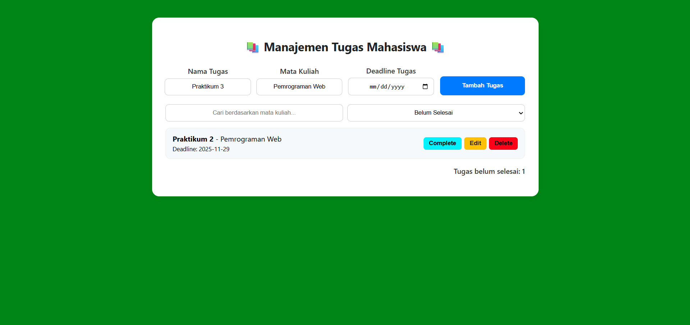
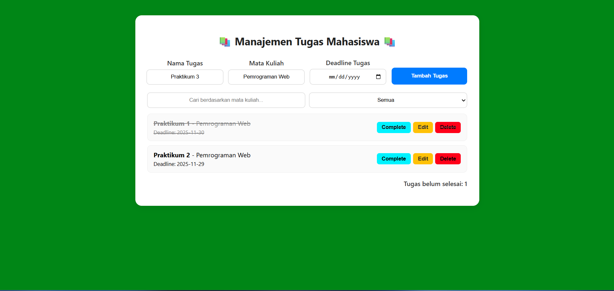

# 📚 Manajemen Tugas Mahasiswa

Aplikasi **Manajemen Tugas Mahasiswa** adalah aplikasi web sederhana yang berfungsi untuk mencatat, menampilkan, dan memfilter daftar tugas perkuliahan. Aplikasi ini membantu mahasiswa mengelola tugas agar lebih teratur dan mudah dipantau.

---

## ✨ Fitur Utama

- Menambahkan tugas baru (nama tugas, mata kuliah, deadline)
- Pencarian tugas berdasarkan mata kuliah
- Filter tugas berdasarkan status (Selesai / Belum Selesai)
- Penyimpanan data menggunakan **localStorage**
- Validasi form input sebelum data disimpan
- Menampilkan total jumlah tugas

---

## 🖼️ Screenshot Aplikasi

> Tambahkan screenshot aplikasi di folder `screenshots/` lalu perbarui link di bawah ini.

**1. Tampilan Awal Aplikasi**


**2. Tampilan Semua Tugas**


**3. Fitur Filter Berdasarkan Deadline**


**4. Fitur Menandai Tugas Selesai**


**5. Filter Tugas Belum Selesai**


**6. Fitur Menandai Tugas Sebagai Complete**


---

## 🚀 Cara Menjalankan Aplikasi

1. Download atau clone repository ini.
2. Pastikan file-file berikut berada dalam satu folder:
   - `index.html`
   - `style.css`
   - `script.js`
3. Buka file **index.html** menggunakan browser (Chrome / Firefox / Edge).
4. Tidak memerlukan server tambahan, aplikasi langsung berjalan.

---

## 📑 Daftar Fitur yang Telah Diimplementasikan

- [x] Menambah tugas baru  
- [x] Menyimpan data ke localStorage  
- [x] Menampilkan daftar tugas  
- [x] Menandai tugas selesai / menghapus tugas (jika tersedia di script.js)  
- [x] Mencari tugas berdasarkan mata kuliah  
- [x] Filter status tugas  
- [x] Validasi input  
- [x] Menghitung jumlah tugas yang tampil

---

## 🔧 Penjelasan Teknis

### 1. Penggunaan localStorage

Aplikasi menggunakan `localStorage` untuk menyimpan data tugas secara permanen di browser. Data yang disimpan berbentuk array, kemudian dikonversi menjadi string menggunakan `JSON.stringify()`.

**Contoh penggunaan:**

```javascript
// Menyimpan data
localStorage.setItem("tasks", JSON.stringify(taskArray));

// Mengambil data
const storedTasks = JSON.parse(localStorage.getItem("tasks")) || [];
