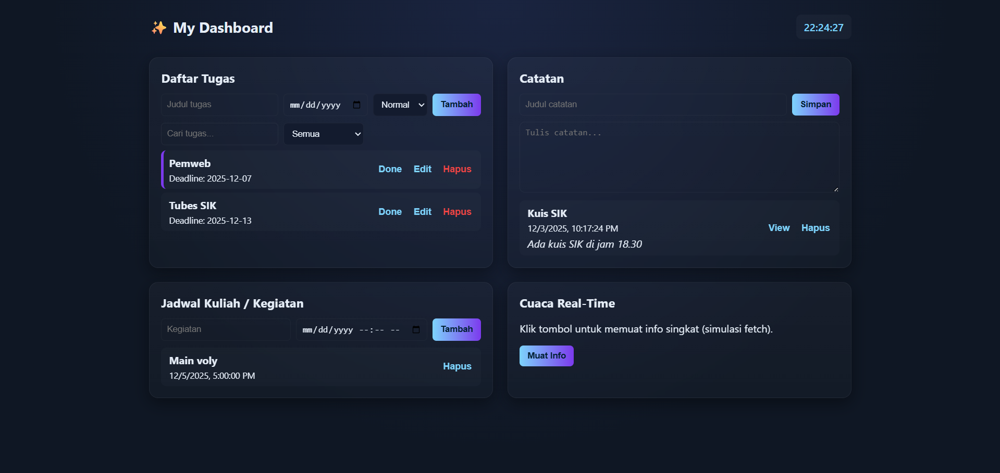

# ✨ Personal Dashboard – JavaScript Project

Project ini adalah **Reminder Dashboard interaktif** berbasis HTML, CSS, dan JavaScript.  
Dashboard memiliki beberapa fitur utama seperti:

- **Daftar Tugas (To-Do List)**
- **Catatan**
- **Jadwal Kuliah / Kegiatan**
- **Jam Real-Time**
- **Fitur Async/Await: Cuaca Real-Time (Open-Meteo API)**
- Penyimpanan otomatis menggunakan **localStorage**
- Tampilan modern dengan efek **glassmorphism**

---

## 📌 1. Struktur Folder

Pastikan folder project memiliki struktur seperti berikut:
/proyek
│── index.html
│── style.css
│── script.js
└── README.md

---

## 📌 2. Cara Menjalankan Project

Tidak memerlukan framework atau server khusus.  
Cukup jalankan **index.html** langsung di browser.

### ▶️ **Langkah Menjalankan**

1. Download / clone project ini
2. Buka folder di **VS Code**
3. Klik **index.html**
4. Klik kanan → **Open with Live Server**  
   *atau buka langsung di Chrome*

Dashboard langsung bisa digunakan.

---

## 📌 3. Fitur-Fitur Dashboard

### ✔️ **1. Daftar Tugas**
- Tambah tugas dengan:
  - Judul
  - Deadline
  - Prioritas (Normal / Penting)
- Tandai selesai / undo
- Edit tugas
- Hapus
- Filter:
  - Semua
  - Belum Selesai
  - Selesai
  - Penting
- Searching

Semua data akan disimpan otomatis di **localStorage**.

---

### ✔️ **2. Catatan**
- Tambah catatan (judul + isi)
- Edit isi catatan
- Hapus catatan
- Penyimpanan otomatis

---

### ✔️ **3. Jadwal Kegiatan**
- Tambah jadwal dengan date-time
- Hapus jadwal
- Jadwal otomatis diurutkan berdasarkan waktu

---

### ✔️ **4. Jam Real-Time**
Jam pada pojok kanan atas diperbarui setiap detik menggunakan JavaScript.

---

### ✔️ **5. Fitur Async/Await – Cuaca Real-Time**
Fitur ini menggunakan:

- **Geolocation API**  
- **Open-Meteo API (Gratis, tanpa API key)**  
- Async/Await untuk fetch data

Cara menggunakan:

1. Klik tombol **“Cek Cuaca Saat Ini”**
2. Browser meminta izin lokasi
3. Jika diizinkan → suhu, angin, dan kondisi cuaca ditampilkan

Contoh hasil:
Cuaca Saat Ini:
Suhu: 31°C
Angin: 8 km/h
Kondisi: Cerah

## Screenshot Aplikasi

**Tampilan Aplikasi**
