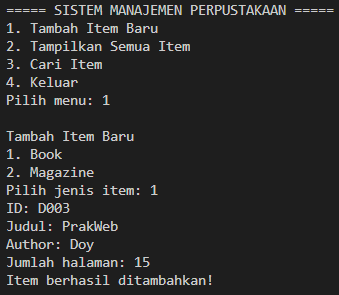
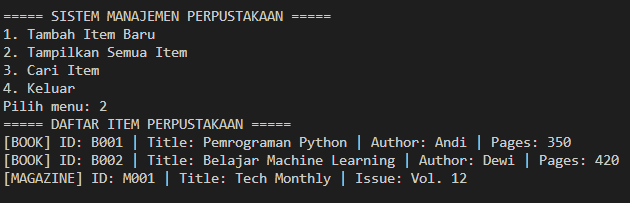
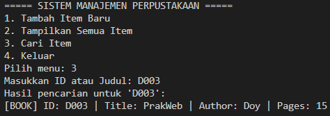

# 📚 Sistem Manajemen Perpustakaan Sederhana (Python OOP)

Program ini merupakan implementasi konsep **Object-Oriented Programming (OOP)** pada Python untuk membuat sistem manajemen perpustakaan sederhana. Program dibuat untuk memenuhi tugas praktikum dengan menerapkan abstract class, inheritance, encapsulation, dan polymorphism.

---

## Fitur Utama Program

### 1. **Manajemen Item Perpustakaan**
Program menyimpan koleksi item seperti Buku dan Majalah. Setiap item memiliki ID dan judul sebagai identitas dasar.

### 2. **Abstract Class & Inheritance**
- Program memiliki abstract class `LibraryItem`.
- Dua subclass yang mewarisi:
  - `Book`
  - `Magazine`
- Keduanya mengimplementasikan method `display_info()`.

### 3. **Encapsulation**
- Menggunakan atribut `protected (_item_id)` dan `private (__title)`.
- Koleksi item pada class `Library` dibuat private (`__collection`).

### 4. **Property Decorator**
- Atribut `title` memiliki getter menggunakan `@property` sehingga read-only.

### 5. **Polymorphism**
- Method `display_info()` pada `Book` dan `Magazine` memiliki implementasi yang berbeda.
- Saat ditampilkan, masing-masing menyesuaikan formatnya.

### 6. **Fitur Sistem**
Program dapat melakukan:
- ✔ Menambahkan item baru (Book / Magazine)
- ✔ Menampilkan semua item
- ✔ Mencari item berdasarkan **judul** atau **ID**
- ✔ Menu interaktif di terminal

---

## Cara Menjalankan Program

1. Install Python minimal versi 3.8  
2. Jalankan file program:

```bash
python library_system.py
```
3. Pilih menu yang tersedia di tampilan terminal.

---

## Screenshot Hasil Running Program

**1. Tampilan Tambah Item**


**2. Tampilan Semua Item**


**3. Tampilan Cari Item**
