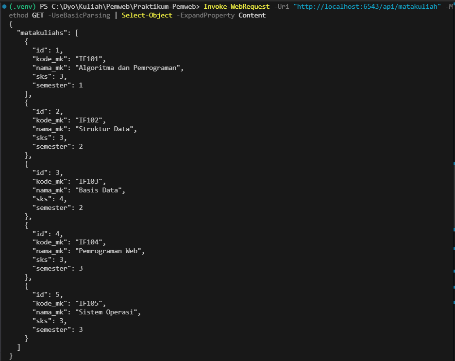
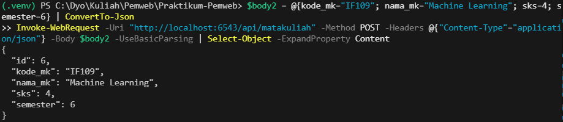

# 📚 Aplikasi Manajemen Matakuliah dengan Pyramid Framework

## 📋 Deskripsi Proyek

**Aplikasi Manajemen Matakuliah** adalah REST API yang dibangun menggunakan **Python Pyramid Framework** untuk mengelola data mata kuliah di institusi pendidikan. Aplikasi ini menyediakan lima endpoint CRUD (Create, Read, Update, Delete) untuk operasi manajemen matakuliah.

### Fitur Utama:
- ✅ **Get All Matakuliah** - Menampilkan semua data matakuliah
- ✅ **Get Matakuliah by ID** - Menampilkan detail satu matakuliah
- ✅ **Create Matakuliah** - Menambah matakuliah baru
- ✅ **Update Matakuliah** - Mengubah data matakuliah
- ✅ **Delete Matakuliah** - Menghapus matakuliah

### Stack Teknologi:
- **Framework**: Pyramid 2.0.2
- **Database**: SQLite dengan SQLAlchemy ORM
- **Server**: Waitress WSGI Server
- **Language**: Python 3.11+

---

## 🔧 Cara Instalasi

### 1️⃣ Membuat Virtual Environment

**Windows (PowerShell):**
```powershell
cd C:\Dyo\Kuliah\Pemweb\Praktikum-Pemweb\Praktikum6
python -m venv .venv
.\.venv\Scripts\Activate.ps1
```

**Linux/Mac:**
```bash
cd Praktikum6
python3 -m venv .venv
source .venv/bin/activate
```

### 2️⃣ Instalasi Dependensi

```bash
pip install -r requirements.txt
```

**File `requirements.txt` berisi:**
```
Pyramid==2.0.2
SQLAlchemy==2.0.23
Waitress==2.1.2
```

### 3️⃣ Konfigurasi Database

Database akan otomatis dibuat saat server dijalankan. Jika ingin pre-populate dengan data sample:

```bash
python init_db.py
```

**Output:**
```
✅ Database sudah berisi data, skip seeding
```

---

## 🚀 Cara Menjalankan

### 1️⃣ Jalankan Server

**Windows (PowerShell):**
```powershell
cd Praktikum6
python run.py
```

**Linux/Mac:**
```bash
cd Praktikum6
python3 run.py
```

**Output yang diharapkan:**
```
==================================================
🚀 API Manajemen Matakuliah
==================================================
📍 Server berjalan di http://localhost:6543
📚 Dokumentasi: README.md
🔗 Endpoint: /api/matakuliah
==================================================
```

### 2️⃣ Server Status

Server berjalan di: **http://localhost:6543**

Untuk menghentikan server, tekan `Ctrl + C`

---

## 📡 API Endpoints

### 1. Get All Matakuliah
Mengambil semua data matakuliah dari database.

**Endpoint:**
```
GET /api/matakuliah
```

**Request (PowerShell):**
```powershell
Invoke-WebRequest -Uri "http://localhost:6543/api/matakuliah" -Method GET -UseBasicParsing | Select-Object -ExpandProperty Content
```

**Response (200 OK):**
```json
{
  "matakuliahs": [
    {
      "id": 1,
      "kode_mk": "IF101",
      "nama_mk": "Algoritma dan Pemrograman",
      "sks": 3,
      "semester": 1
    },
    {
      "id": 2,
      "kode_mk": "IF102",
      "nama_mk": "Struktur Data",
      "sks": 3,
      "semester": 2
    },
    {
      "id": 3,
      "kode_mk": "IF103",
      "nama_mk": "Basis Data",
      "sks": 4,
      "semester": 2
    },
    {
      "id": 4,
      "kode_mk": "IF104",
      "nama_mk": "Pemrograman Web",
      "sks": 3,
      "semester": 3
    },
    {
      "id": 5,
      "kode_mk": "IF105",
      "nama_mk": "Sistem Operasi",
      "sks": 3,
      "semester": 3
    }
  ]
}
```

**Screenshot:**


---

### 2. Get Matakuliah by ID
Mengambil detail satu matakuliah berdasarkan ID.

**Endpoint:**
```
GET /api/matakuliah/{id}
```

**Request (PowerShell):**
```powershell
Invoke-WebRequest -Uri "http://localhost:6543/api/matakuliah/1" -Method GET -UseBasicParsing | Select-Object -ExpandProperty Content
```

**Response (200 OK):**
```json
{
  "id": 1,
  "kode_mk": "IF101",
  "nama_mk": "Algoritma dan Pemrograman",
  "sks": 3,
  "semester": 1
}
```

**Error Response (404 Not Found):**
```json
{
  "error": "Matakuliah tidak ditemukan"
}
```

**Screenshot:**
.png)

---

### 3. Create Matakuliah
Menambahkan matakuliah baru ke database.

**Endpoint:**
```
POST /api/matakuliah
```

**Request Body (Required):**
```json
{
  "kode_mk": "IF106",
  "nama_mk": "Grafika Komputer",
  "sks": 3,
  "semester": 4
}
```

**Request (PowerShell):**
```powershell
$body = @{
    kode_mk = "IF106"
    nama_mk = "Grafika Komputer"
    sks = 3
    semester = 4
} | ConvertTo-Json

Invoke-WebRequest -Uri "http://localhost:6543/api/matakuliah" `
    -Method POST `
    -Headers @{"Content-Type"="application/json"} `
    -Body $body `
    -UseBasicParsing | Select-Object -ExpandProperty Content
```

**Response (201 Created):**
```json
{
  "id": 6,
  "kode_mk": "IF106",
  "nama_mk": "Grafika Komputer",
  "sks": 3,
  "semester": 4
}
```

**Error Response (400 Bad Request):**
```json
{
  "error": "Field sks harus diisi"
}
```

**Screenshot:**


---

### 4. Update Matakuliah
Mengubah data matakuliah yang sudah ada.

**Endpoint:**
```
PUT /api/matakuliah/{id}
```

**Request Body (Optional - Bisa update sebagian atau semua):**
```json
{
  "nama_mk": "Struktur Data - Advanced",
  "sks": 4,
  "semester": 3
}
```

**Request (PowerShell):**
```powershell
$body = @{
    nama_mk = "Struktur Data - Advanced"
    sks = 4
} | ConvertTo-Json

Invoke-WebRequest -Uri "http://localhost:6543/api/matakuliah/2" `
    -Method PUT `
    -Headers @{"Content-Type"="application/json"} `
    -Body $body `
    -UseBasicParsing | Select-Object -ExpandProperty Content
```

**Response (200 OK):**
```json
{
  "id": 2,
  "kode_mk": "IF102",
  "nama_mk": "Struktur Data - Advanced",
  "sks": 4,
  "semester": 3
}
```

**Error Response (404 Not Found):**
```json
{
  "error": "Matakuliah tidak ditemukan"
}
```

**Validasi Error:**
```json
{
  "error": "Semester harus antara 1-8"
}
```

---

### 5. Delete Matakuliah
Menghapus matakuliah dari database.

**Endpoint:**
```
DELETE /api/matakuliah/{id}
```

**Request (PowerShell):**
```powershell
Invoke-WebRequest -Uri "http://localhost:6543/api/matakuliah/6" -Method DELETE -UseBasicParsing | Select-Object -ExpandProperty Content
```

**Response (200 OK):**
```json
{
  "message": "Matakuliah berhasil dihapus"
}
```

**Error Response (404 Not Found):**
```json
{
  "error": "Matakuliah tidak ditemukan"
}
```

**Screenshot:**
.png)
.png)

---

## 🧪 Testing

### Persiapan Testing

1. **Pastikan Server Running:**
   ```powershell
   python run.py
   ```

2. **Buka PowerShell Baru** (terminal terpisah)

3. **Navigasi ke folder Praktikum6:**
   ```powershell
   cd C:\Dyo\Kuliah\Pemweb\Praktikum-Pemweb\Praktikum6
   ```

### Test 1: GET All Matakuliah

**Command:**
```powershell
Invoke-WebRequest -Uri "http://localhost:6543/api/matakuliah" -Method GET -UseBasicParsing | Select-Object -ExpandProperty Content
```

**Expected Output:**
Status code `200` dengan list semua matakuliah.

---

### Test 2: GET Matakuliah by ID

**Command:**
```powershell
Invoke-WebRequest -Uri "http://localhost:6543/api/matakuliah/1" -Method GET -UseBasicParsing | Select-Object -ExpandProperty Content
```

**Expected Output:**
Status code `200` dengan detail matakuliah ID 1.

**Screenshot:**
.png)
.png)

---

### Test 3: CREATE Matakuliah

**Command:**
```powershell
$body = @{
    kode_mk = "IF107"
    nama_mk = "Cloud Computing"
    sks = 3
    semester = 5
} | ConvertTo-Json

Invoke-WebRequest -Uri "http://localhost:6543/api/matakuliah" `
    -Method POST `
    -Headers @{"Content-Type"="application/json"} `
    -Body $body `
    -UseBasicParsing | Select-Object -ExpandProperty Content
```

**Expected Output:**
Status code `201` dengan data matakuliah baru yang dibuat.

---

### Test 4: UPDATE Matakuliah

**Command:**
```powershell
$body = @{
    nama_mk = "Basis Data Oracle"
    sks = 4
} | ConvertTo-Json

Invoke-WebRequest -Uri "http://localhost:6543/api/matakuliah/3" `
    -Method PUT `
    -Headers @{"Content-Type"="application/json"} `
    -Body $body `
    -UseBasicParsing | Select-Object -ExpandProperty Content
```

**Expected Output:**
Status code `200` dengan data matakuliah yang sudah diupdate.

---

### Test 5: DELETE Matakuliah

**Command:**
```powershell
Invoke-WebRequest -Uri "http://localhost:6543/api/matakuliah/6" -Method DELETE -UseBasicParsing | Select-Object -ExpandProperty Content
```

**Expected Output:**
Status code `200` dengan message "Matakuliah berhasil dihapus".

---

## 📊 Data Model

### Matakuliah Table

| Field | Type | Constraint | Deskripsi |
|-------|------|-----------|-----------|
| `id` | Integer | PRIMARY KEY, AUTO INCREMENT | ID unik matakuliah |
| `kode_mk` | Text | UNIQUE, NOT NULL | Kode mata kuliah (e.g., IF101) |
| `nama_mk` | Text | NOT NULL | Nama mata kuliah |
| `sks` | Integer | NOT NULL, > 0 | Satuan Kredit Semester (1-8) |
| `semester` | Integer | NOT NULL, 1-8 | Semester penawaran |

### Sample Data (Default)

```
ID | Kode | Nama | SKS | Semester
1  | IF101 | Algoritma dan Pemrograman | 3 | 1
2  | IF102 | Struktur Data | 3 | 2
3  | IF103 | Basis Data | 4 | 2
4  | IF104 | Pemrograman Web | 3 | 3
5  | IF105 | Sistem Operasi | 3 | 3
```

---

## ✅ Validasi & Error Handling

### Validasi yang Diterapkan:

1. **Kode Matakuliah (`kode_mk`)**
   - Harus unik (tidak boleh ada duplikat)
   - Harus diisi (required)
   - Otomatis di-trim dari whitespace

2. **Nama Matakuliah (`nama_mk`)**
   - Harus diisi (required)
   - Otomatis di-trim dari whitespace

3. **SKS (`sks`)**
   - Harus angka (integer)
   - Harus lebih besar dari 0
   - Wajib diisi

4. **Semester (`semester`)**
   - Harus angka (integer)
   - Harus antara 1-8
   - Wajib diisi

### Error Messages:

| Error | Status | Message |
|-------|--------|---------|
| Field Kosong | 400 | `Field {field} harus diisi` |
| Invalid Type | 400 | `SKS dan Semester harus berupa angka` |
| Invalid Range | 400 | `Semester harus antara 1-8` |
| Duplicate Kode | 400 | `Kode matakuliah sudah terdaftar` |
| Not Found | 404 | `Matakuliah tidak ditemukan` |
| Server Error | 500 | `Error: {detail}` |

---

## 📁 Struktur Proyek

```
Praktikum6/
├── matakuliah_api/
│   ├── __init__.py                 # Konfigurasi Pyramid app
│   ├── database.py                 # SQLAlchemy config
│   ├── models/
│   │   └── matakuliah.py          # Model Matakuliah
│   └── views/
│       └── matakuliah.py          # API endpoints
├── assets/
│   ├── SemuaMatkul.png
│   ├── CariMatkul(Id).png
│   ├── MenambahkanMatkul.png
│   └── ...
├── init_db.py                      # Database initialization
├── run.py                          # Server entry point
├── requirements.txt                # Dependencies
├── README.md                       # Documentation
└── matakuliah.db                  # SQLite database (auto-created)
```

---

## 🛠️ Troubleshooting

### Server tidak berjalan

**Masalah:** `ModuleNotFoundError: No module named 'pyramid'`

**Solusi:**
```bash
pip install -r requirements.txt
```

### Database error

**Masalah:** Database file tidak ditemukan

**Solusi:**
```bash
python init_db.py
```

### Port 6543 sudah digunakan

**Masalah:** `Address already in use`

**Solusi:**
```powershell
# Kill process yang menggunakan port 6543
Get-Process | Where-Object {$_.Id -eq (netstat -aon | findstr :6543 | ForEach-Object {$_.Split()[-1]}) }  | Stop-Process -Force
```

---

## 📝 Catatan Penting

- Database menggunakan **SQLite** (file `matakuliah.db`)
- Semua request/response dalam format **JSON**
- Server default berjalan di **port 6543**
- Perlu **virtual environment** untuk menjalankan proyek
- Gunakan PowerShell dengan flag `-UseBasicParsing` untuk testing di Windows

---

## 👨‍💻 Author

**Praktikum 6 - Pyramid Framework API**
Pemrograman Web 2024

---

## 📄 License

This project is for educational purposes only.

---

## 🔗 Endpoints Summary

| Method | Endpoint | Deskripsi |
|--------|----------|-----------|
| GET | `/api/matakuliah` | Ambil semua matakuliah |
| GET | `/api/matakuliah/{id}` | Ambil matakuliah by ID |
| POST | `/api/matakuliah` | Buat matakuliah baru |
| PUT | `/api/matakuliah/{id}` | Update matakuliah |
| DELETE | `/api/matakuliah/{id}` | Hapus matakuliah |

**Server**: http://localhost:6543

---

*Last Updated: December 23, 2024*

